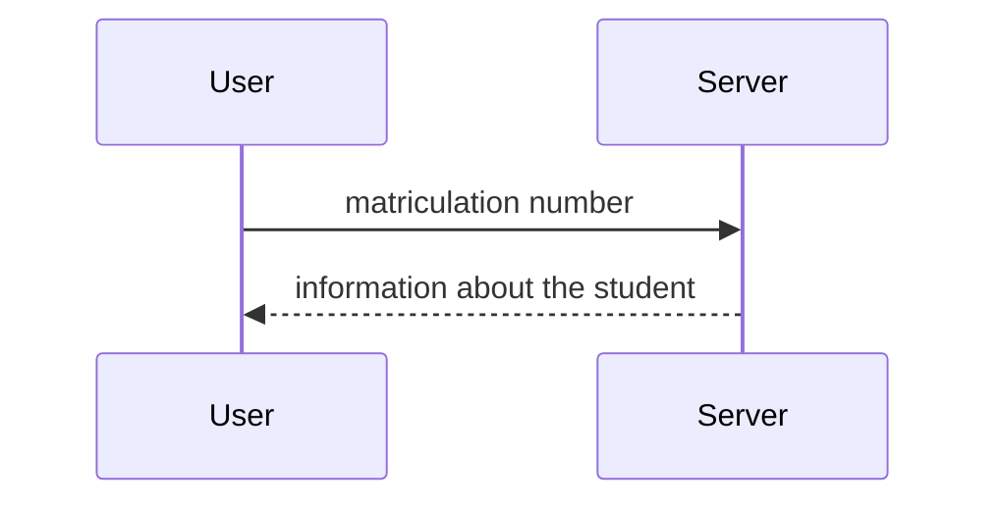

# Simple Android app (Small Uni Project)

This app serves the purpose to fetch the time a student has been registered at the University for.

Furthermore the app can calculate if there are any two numbers in the matriculation number which can be divided.

# Simpe Data fetch

